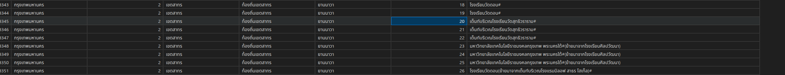
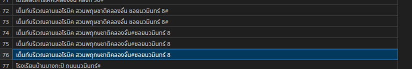

# Unit Name Processing Spec for the Main Election Day

## Objectives
1. define a structure schema for unit name processing. that benefits
1.1. place search text query either geo-decoding or place search api.
1.2. recreate the full location or anchor location + description, sublocation and ballot unit, 1 location could have multiple ballot units.

## Ben's Observations

1. subsequent rows are same location. maybe having a minor difference or extra info.
1.1 
1.2  but still same location. `โรงเรียนอัสสัมชัญ แผนกประถม#`(with space) and `โรงเรียนอัสสัมชัญแผนกประถม#`(without space) `โรงเรียนอัสสัมชัญแผนกประถม#(ย้ายมาจากโรงเรียนอัสสัมชัญพาณิชยการ)` (with parenthetical).
1.3  `เต็นท์บริเวณลานแอโรบิค สวนพฤษชาติคลองจั่น ซอยนวมินทร์ 8#` `เต็นท์บริเวณลานแอโรบิค สวนพฤกษชาติคลองจั่น#ซอยนวมินทร์ 8`
2. # at end of location name(`มหาวิทยาลัยเทคโนโลยีราชมงคลกรุงเทพ พระนครใต้#`), sometimes a word before  last one(`มหาวิทยาลัยเทคโนโลยีราชมงคลกรุงเทพ พระนครใต้#(ย้ายมาจากโรงเรียนศิลปวัฒนา)`).

3. note: move from e.g. `โรงเรียนอัสสัมชัญแผนกประถม#(ย้ายมาจากโรงเรียนอัสสัมชัญพาณิชยการ)` `มหาวิทยาลัยเทคโนโลยีราชมงคลกรุงเทพ พระนครใต้#(ย้ายมาจากโรงเรียนศิลปวัฒนา)`

4. location anchor with direction `เต็นท์บริเวณริมคลองคูเมืองเดิม ถนนอัษฎางค์ #ตรงข้าม บริษัท นัฐพงษ์เซลส์แอนด์เซอร์วิส จำกัด`
the place name is `ริมคลองคูเมืองเดิม ถนนอัษฎางค์` which is likely to failed the geo-decoding and the rest is extra info that could pin point the location some are exact locations.
`เต็นท์บริเวณเดอะรามวิลล่า  #(ใกล้ศูนย์ฮอนด้าหัวหมาก ซอยรามคำแหง 85)`

5. some places are big has multiple entrances e.g. `วิทยาลัยศิลปหัตถกรรมกรุงเทพ ถนนลาดพร้าว 101#(ใกล้ซอย 39)` the place name is `วิทยาลัยศิลปหัตถกรรมกรุงเทพ` and the rest is needed to locate exact entrance.

> 4. and 5. could be the same

6. same place with order `เต็นท์บริเวณโรงเรียนศาลาคู้(1)#` and `เต็นท์บริเวณโรงเรียนศาลาคู้(2)#` `เต็นท์บริเวณโรงเรียนศาลาคู้ (3)#` `เต็นท์บริเวณวิทยาลัยเทคนิคกาญจนาภิเษกมหานคร (1)#` and `เต็นท์บริเวณวิทยาลัยเทคนิคกาญจนาภิเษกมหานคร (2)#` upto `เต็นท์บริเวณวิทยาลัยเทคนิคกาญจนาภิเษกมหานคร (6)#`
-> need to group these together.

7. some `เต็นท์ลานจอดรถร้านเซ่เว่นอีเลฟเว่น ซอยลาดกระบัง 26#` key location is `เซ่เว่นอีเลฟเว่น ซอยลาดกระบัง 26` sub-location is `ลานจอดรถ` construction is `เต็นท์` - a temporary structure.

8. some has clear sublocation `วัดหิรัญรูจี (ศาลา 1)#` place name is `วัดหิรัญรูจี` sublocation is `ศาลา 1` `วัดหิรัญรูจี (ศาลา 4)#` `วัดหิรัญรูจี (ศาลา 5)#`

9. # random place now in move location note `เต็นท์ลานกีฬาสวนราษฎร์บำเพ็ญ ซอยประชาราษฎร์บำเพ็ญ 9 (ย้าย#มาจากเต็นท์ลานกีฬาสวนราษฎร์บำเพ็ญ ซอยประชาราษฎร์บำเพ็ญ11)`

10. weird char instead of # `เต็นท์ลานจอดรถฝ่ายรักษาความสะอาดฯข้างเซเว่นอีเลฟเว่น#ุถนนประชาอุทิศ(ย้ายมาจากเซเว่นฯ)` `เต็นท์ลานจอดรถฝ่ายรักษาความสะอาดฯข้างเซเว่นอีเลฟเว่น#ถนนประชาอุทิศ(ย้ายมาจากเซเว่นฯ)`
