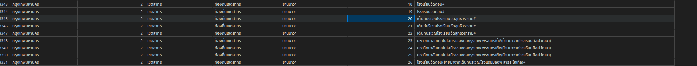
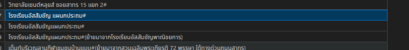
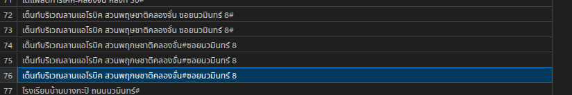

# Unit Name Processing Spec for the Main Election Day

## Objectives
1. define a structure schema for unit name processing. that benefits
1.1. place search text query either geo-decoding or place search api.
1.2. recreate the full location or anchor location + description, sublocation and ballot unit, 1 location could have multiple ballot units.

## EDA Summary

| Metric | Value |
|--------|-------|
| Total rows | 99,954 |
| Unique locations | ~80,927 |
| Provinces | 77 |
| Districts | 924 |
| Tambons | 5,849 |

### Key Patterns Found

| Pattern | Count | % |
|---------|-------|---|
| Has `#` | 99,954 | 100% |
| Ends with `#` | ~96,985 | ~97% |
| `#` in middle (extra info follows) | ~2,967 | ~3% |
| Has parenthetical `()` | ~13,874 | ~14% |
| Numbered suffix `(1)`, `(2)` | 2,626 | 2.6% |
| Sublocation `(ศาลา 1)` | 106 | 0.1% |
| Relocation notes `ย้ายมาจาก` | 18 | <0.1% |
| Direction indicators | 1,763 | 1.8% |

### Location Types Distribution

| Type | Count | % |
|------|-------|---|
| pavilion (ศาลา) | 18,897 | 18.9% |
| community_pavilion (ศาลาประชาคม) | 14,945 | 15.0% |
| multipurpose_pavilion (ศาลาอเนกประสงค์) | 11,304 | 11.3% |
| (unclassified) | 10,457 | 10.5% |
| school (โรงเรียน) | 8,316 | 8.3% |
| multipurpose_building (อาคารเอนกประสงค์) | 6,686 | 6.7% |
| temple_pavilion (ศาลาวัด) | 6,660 | 6.7% |
| building (อาคาร) | 5,562 | 5.6% |
| tent_area (เต็นท์บริเวณ) | 4,248 | 4.2% |
| temple (วัด) | 2,574 | 2.6% |
| assembly_hall (หอประชุม) | 2,429 | 2.4% |
| area (บริเวณ/ลาน) | 2,315 | 2.3% |
| tent (เต็นท์) | 1,946 | 1.9% |

### Data Quality Issues Found

- 5 rows with corrupted chars (`#ุ` instead of `#`)
- 1 row with `#` inside relocation note `(ย้าย#มาจาก...)`
- ~790 duplicate locations after normalization

## Ben's Observations

1. subsequent rows are same location. maybe having a minor difference or extra info.
1.1 
1.2  but still same location. `โรงเรียนอัสสัมชัญ แผนกประถม#`(with space) and `โรงเรียนอัสสัมชัญแผนกประถม#`(without space) `โรงเรียนอัสสัมชัญแผนกประถม#(ย้ายมาจากโรงเรียนอัสสัมชัญพาณิชยการ)` (with parenthetical).
1.3  `เต็นท์บริเวณลานแอโรบิค สวนพฤษชาติคลองจั่น ซอยนวมินทร์ 8#` `เต็นท์บริเวณลานแอโรบิค สวนพฤกษชาติคลองจั่น#ซอยนวมินทร์ 8`
2. # at end of location name(`มหาวิทยาลัยเทคโนโลยีราชมงคลกรุงเทพ พระนครใต้#`), sometimes a word before  last one(`มหาวิทยาลัยเทคโนโลยีราชมงคลกรุงเทพ พระนครใต้#(ย้ายมาจากโรงเรียนศิลปวัฒนา)`).

3. note: move from e.g. `โรงเรียนอัสสัมชัญแผนกประถม#(ย้ายมาจากโรงเรียนอัสสัมชัญพาณิชยการ)` `มหาวิทยาลัยเทคโนโลยีราชมงคลกรุงเทพ พระนครใต้#(ย้ายมาจากโรงเรียนศิลปวัฒนา)`

4. location anchor with direction `เต็นท์บริเวณริมคลองคูเมืองเดิม ถนนอัษฎางค์ #ตรงข้าม บริษัท นัฐพงษ์เซลส์แอนด์เซอร์วิส จำกัด`
the place name is `ริมคลองคูเมืองเดิม ถนนอัษฎางค์` which is likely to failed the geo-decoding and the rest is extra info that could pin point the location some are exact locations.
`เต็นท์บริเวณเดอะรามวิลล่า  #(ใกล้ศูนย์ฮอนด้าหัวหมาก ซอยรามคำแหง 85)`

5. some places are big has multiple entrances e.g. `วิทยาลัยศิลปหัตถกรรมกรุงเทพ ถนนลาดพร้าว 101#(ใกล้ซอย 39)` the place name is `วิทยาลัยศิลปหัตถกรรมกรุงเทพ` and the rest is needed to locate exact entrance.

> 4. and 5. could be the same

6. same place with order `เต็นท์บริเวณโรงเรียนศาลาคู้(1)#` and `เต็นท์บริเวณโรงเรียนศาลาคู้(2)#` `เต็นท์บริเวณโรงเรียนศาลาคู้ (3)#` `เต็นท์บริเวณวิทยาลัยเทคนิคกาญจนาภิเษกมหานคร (1)#` and `เต็นท์บริเวณวิทยาลัยเทคนิคกาญจนาภิเษกมหานคร (2)#` upto `เต็นท์บริเวณวิทยาลัยเทคนิคกาญจนาภิเษกมหานคร (6)#`
-> need to group these together.

7. some `เต็นท์ลานจอดรถร้านเซ่เว่นอีเลฟเว่น ซอยลาดกระบัง 26#` key location is `เซ่เว่นอีเลฟเว่น ซอยลาดกระบัง 26` sub-location is `ลานจอดรถ` construction is `เต็นท์` - a temporary structure.

8. some has clear sublocation `วัดหิรัญรูจี (ศาลา 1)#` place name is `วัดหิรัญรูจี` sublocation is `ศาลา 1` `วัดหิรัญรูจี (ศาลา 4)#` `วัดหิรัญรูจี (ศาลา 5)#`

9. # random place now in move location note `เต็นท์ลานกีฬาสวนราษฎร์บำเพ็ญ ซอยประชาราษฎร์บำเพ็ญ 9 (ย้าย#มาจากเต็นท์ลานกีฬาสวนราษฎร์บำเพ็ญ ซอยประชาราษฎร์บำเพ็ญ11)`

10. weird char instead of # `เต็นท์ลานจอดรถฝ่ายรักษาความสะอาดฯข้างเซเว่นอีเลฟเว่น#ุถนนประชาอุทิศ(ย้ายมาจากเซเว่นฯ)` `เต็นท์ลานจอดรถฝ่ายรักษาความสะอาดฯข้างเซเว่นอีเลฟเว่น#ถนนประชาอุทิศ(ย้ายมาจากเซเว่นฯ)`

## Output Schema

**Cleaned Parquet:** `intermediate/ect69_voting_units_cleaned.parquet`

```python
{
    # Original columns (preserved)
    "จังหวัด": str,
    "เขตเลือกตั้ง": int,
    "อำเภอ": str,
    "สำนักทะเบียน": str,
    "ตำบล": str,
    "หน่วยเลือกตั้ง": int,

    # Original location (renamed)
    "สถานที่เลือกตั้ง_raw": str,

    # Cleaned/parsed fields
    "location_main": str,          # Main location for geocoding
    "location_extra": str | None,  # After # if present
    "location_type": str | None,   # Classified prefix type
    "unit_sequence": int | None,   # (1), (2) etc
    "sublocation": str | None,     # (ศาลา 1) etc
    "relocation_note": str | None, # (ย้ายมาจาก...)
    "direction": str | None,       # (ฝั่ง...), (ด้านซ้าย)

    # For geocoding deduplication
    "location_id": str,            # Hash of normalized location
    "geocode_query": str,          # Final search string
}
```

## Implementation

**Script:** `scripts/clean_main_voting_units.py`

**Run command:**
```bash
uv run python ect69-geo-decoding/scripts/clean_main_voting_units.py
```

### EDA feedback
Ben's
1. some sublocation is lost `โรงเรียนเผยอิง (ห้องเรียนฝั่งขวา)#` sublocation is `ห้องเรียนฝั่งขวา`
2. `เต็นท์บ้านโรจนา (ASHA GUEST HOUSE) ซอยอินทามระ 3#` main location is `บ้านโรจนา (ASHA GUEST HOUSE) ซอยอินทามระ 3` is lost or `โรงเรียนบดินทรเดชา (สิงห์ สิงหเสนี) 2 ซอยนวมินทร์ 72#` `โรงเรียนบดินทรเดชา 2 ซอยนวมินทร์ 72` is lost the `(สิงห์ สิงหเสนี)` part.

## ideation novel ways to process

### baseline ect66 pro
1. create agent
